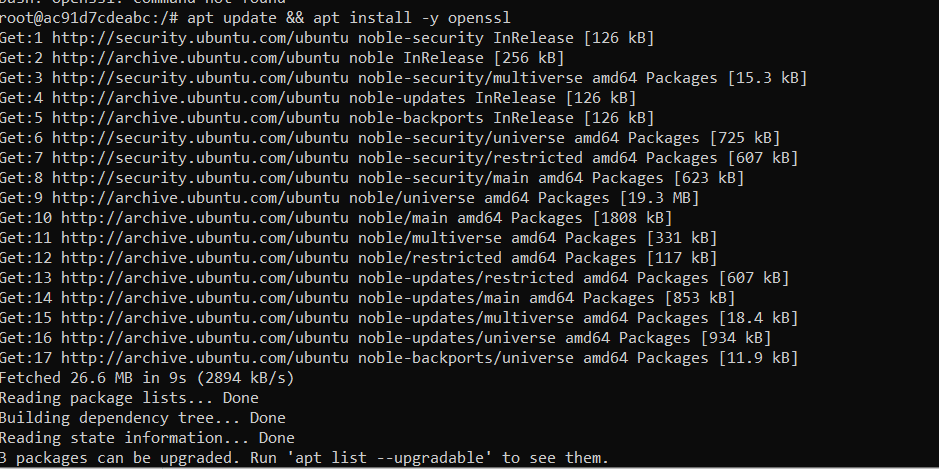

# Task 1: Public-key based authentication 
**Question 1**: 
Implement public-key based authentication step-by-step with openssl according the following scheme.

**Answer 1**:
##Step 1: Creating different docker compose:
First, we set up 2 different computers, the Server-Client to be exact

And Client: 
![Client].(Client.png)
Next, we will create the private key for encrytion, in the client side of course
##Step 2: Creating public and private key 
First, we have to install some nessesary packets: Openssl, nmap, SSH, so on

Then, we create a private and public key in the client by using
` openssl genrsa -out client_private_key.pem 2048`
And `openssl rsa -in client_private_key.pem -pubout -out client_public_key.pem`
Then, we create a "Challenge" file
And 'CHALLENGE$(openssl rand -base64 32) echo -n "$CHALLENGE" | openssl rsautl -encrypt -pubin -inkey client_public_key.pem -out encrypted_challenge.bin'
After that, we send the file from the server to the client, returning them with Challenge message encrypted by public key
We are here: `Creating Client and Server`-> `Set public key and private key` -> `Create message file`-> *Send encrypted file*-> `Decrypted message by private key`->`Sign with the private key`->'Send back to Server'->`Server received and decrypt by private key`
Next, we will Decrypt the challenge message:
I'm current storing them in boot/client_private_key.pem:
`openssl pkeyutl -decrypt -inkey boot/client_private_key.pem -in /tmp/encrypted_challenge.bin -out decrypted_challenge.txt`
This is a bit conventional, but I just use the cmd to send file:
`docker cp encrypted_challenge.bin Client:/ecrypted_challenge.bin`
Now, I can decrypt using the private key:
`# openssl pkeyutl -decrypt -inkey /boot/client_private_key.pem -in /dev/encrypted_challenge.bin -out decrypted_challenge.txt`
A decrypted_challenge.txt file is made

From the binary file, we can observe the result in decrypted_challenge.txt file in dockerfile, as create :

Message said *This is encrypted message* 
Let's sign it with the private key to send back to server:

